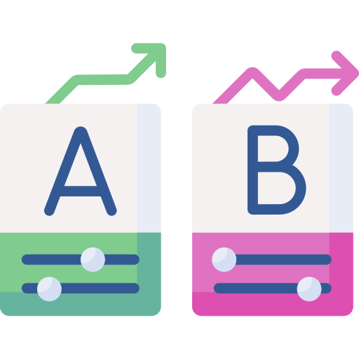

# Описание проекта - Проверка гипотез по увеличению выручки в интернет-магазине
Проведена приоритизация гипотез по фреймворкам ICE и RICE. Затем провел анализ результатов A/B-теста, построил графики кумулятивной выручки, среднего чека, конверсии по группам, а затем посчитал статистическую значимость различий конверсий и средних чеков по сырым и очищенным данным.

## Используемые технологии

 

## Задача

- Примените фреймворк ICE для приоритизации гипотез. 
- Примените фреймворк RICE для приоритизации гипотез.
- Произвести оценку результатов A/B-тестирования различными методами

## Данные

Файл hypothesis.csv
- Hypothesis — краткое описание гипотезы;
- Reach — охват пользователей по 10-балльной шкале;
- Impact — влияние на пользователей по 10-балльной шкале;
- Confidence — уверенность в гипотезе по 10-балльной шкале;
- Efforts — затраты ресурсов на проверку гипотезы по 10-балльной шкале. Чем больше значение Efforts, тем дороже проверка гипотезы.
- 
Файл orders.csv
- transactionId — идентификатор заказа;
- visitorId — идентификатор пользователя, совершившего заказ;
- date — дата, когда был совершён заказ;
- revenue — выручка заказа;
- group — группа A/B-теста, в которую попал заказ.
- 
Файл visitors.csv
- date — дата;
- group — группа A/B-теста;
- visitors — количество пользователей в указанную дату в указанной группе A/B-теста
